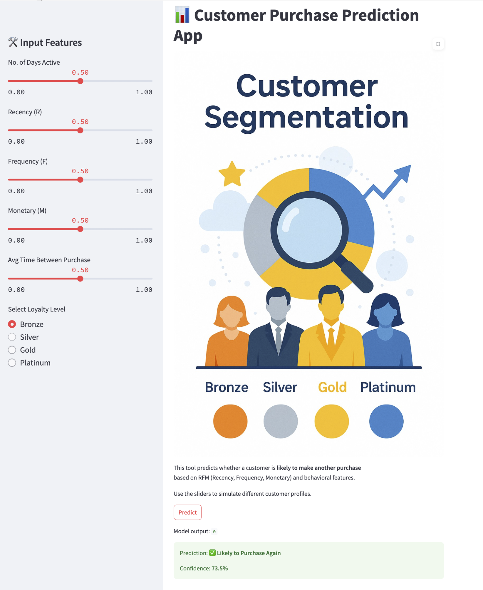

# 🧠 Customer Segmentation & Purchase Prediction App

This project combines customer segmentation analysis with a predictive model to identify customers most likely to make another purchase.  
It demonstrates end-to-end skills in data preprocessing, feature engineering, model training, and interactive app deployment.

---

## 📊 Part 1: RFM Segmentation & Exploratory Analysis

We applied **Recency, Frequency, and Monetary (RFM)** analysis — where:  
- **Recency** = how recently a customer made a purchase  
- **Frequency** = how often they purchase  
- **Monetary** = how much they spend  
- Helping us categorize customer loyalty levels and explore behavioral trends.

### ✅ Key Tasks:
- Cleaned and formatted customer transaction data  
- Generated RFM scores and assigned loyalty levels  
- Engineered new features: `no_of_days_active`, `avg_time_between_purchase`  
- Visualized trends using `pandas`, `matplotlib`, and `seaborn`

---

## 🤖 Part 2: Purchase Prediction Model

Built a **binary classification model** to predict whether a customer is *likely to purchase again*.

### ⚙️ ML Workflow:
- **Features**: `R`, `F`, `M`, `no_of_days_active`, `avg_time_between_purchase` + one-hot encoded loyalty level  
- **Target**: `Purchase (1)` or `No Purchase (0)`  
- **Handling class imbalance**: adjusted labels to binary manually (original were multi-class); SMOTE was also considered  
- **Model**: `XGBoost Classifier`  
- **Tuning**: `RandomizedSearchCV` for best hyperparameters  
- **Evaluation**: Classification report, Confusion Matrix, ROC AUC

---

## 🖥️ Part 3: Streamlit App Deployment

A fully deployed app that lets users simulate customer profiles using sliders and view predictions in real time.

### 🎨 App Features:
- Sliders for all behavior & RFM features  
- Loyalty level radio buttons (one-hot encoded in real time)  
- Live predictions with confidence percentage  
- Clean layout with branded banner image  
- End-to-end deployment with full control over backend model and frontend app logic  
- Hosted on Streamlit Cloud  

👉 **Launch the app:**  
🔗 [customersegmentationusingrfm-pyfhxyvkrcuiggshixtzec.streamlit.app](https://customersegmentationusingrfm-pyfhxyvkrcuiggshixtzec.streamlit.app)

---

## 🧠 Skills Demonstrated

- ✅ Data Cleaning & EDA  
- ✅ Feature Engineering  
- ✅ One-hot Encoding  
- ✅ Model Training (XGBoost)  
- ✅ Hyperparameter Tuning  
- ✅ Model Serialization (`.pkl`)  
- ✅ Streamlit App Development  
- ✅ GitHub Version Control  
- ✅ Cloud Deployment (Streamlit)

---

## 📁 Repository Contents

| File                          | Description                                   |
|-------------------------------|-----------------------------------------------|
| `Customer_Segmentation_RFM.ipynb` | Full EDA, feature engineering & model training |
| `app.py`                      | Streamlit app for prediction                  |
| `xgboost_model.pkl`           | Trained model (serialized)                    |
| `customer_segmentation_banner.png` | App image                                 |
| `requirements.txt`            | App dependencies                              |

---

## 💼 Business Use Cases

- 🎯 Identify high-value or at-risk customers  
- 🔁 Simulate “what-if” behavior for marketing campaigns  
- 📈 Prioritize retention efforts based on predictions  
- 💡 Turn customer data into actionable insights

---

## 🔮 Next Steps

- Integrate SHAP for explainability  
- Add bulk prediction (CSV upload)  
- Automate loyalty tier classification

---

## 👤 Author

- [Anease Akhtar](https://github.com/akhtaranease)

---
