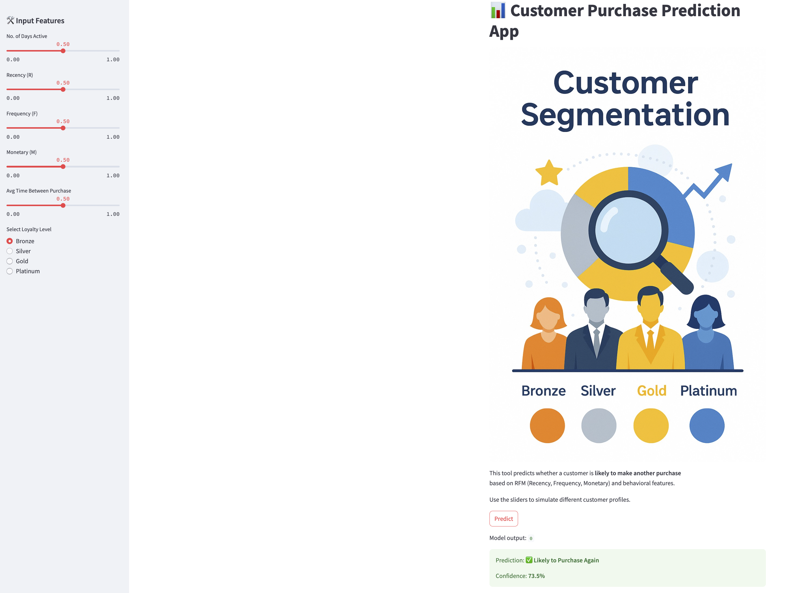

# 🧠 Customer Segmentation & Purchase Prediction App

This project combines customer segmentation analysis with a predictive model to identify customers most likely to make another purchase. It demonstrates end-to-end skills in data preprocessing, feature engineering, model building, and deployment.

---

## 📊 Part 1: RFM Segmentation & Exploratory Analysis

We applied **Recency, Frequency, and Monetary (RFM)** analysis to categorize customer loyalty levels and explore behavioral trends.

### ✅ Key Tasks:
- Data cleaning and wrangling (null handling, duplicates, formatting)
- RFM score generation
- Loyalty tiers assigned based on RFM thresholds
- Feature engineering: days active, average time between purchases
- EDA using pandas, matplotlib, seaborn

---

## 🤖 Part 2: Purchase Prediction Model

Built a binary classification model to predict whether a customer is **likely to purchase again** using engineered RFM features and loyalty levels.

### ⚙️ ML Workflow:
- Features: `R`, `F`, `M`, `no_of_days_active`, `avg_time_between_purchase`, one-hot encoded loyalty
- Target: `Purchase (1)` or `No Purchase (0)`
- Balancing technique to handle class imbalance (manual label adjustment + SMOTE considered)
- Model: **XGBoost Classifier**
- **RandomizedSearchCV** for hyperparameter tuning
- Evaluation: classification report, confusion matrix, ROC AUC

---

## 🖥️ Part 3: Streamlit App Deployment

A fully deployed app allowing users to simulate different customer profiles and see predictions.

### 🎨 App Features:
- Sliders for all RFM and behavioral features
- Radio buttons for loyalty level
- Live predictions with confidence scores
- One-hot encoding handled in real-time
- Beautiful banner image for branding
- Hosted on Streamlit Cloud

👉 **[Launch App](https://customersegmentationusingrfm-pyfhxyvkrcuiggshixtzec.streamlit.app/)**

---

## 🧠 Skills Demonstrated

- ✅ Data Cleaning & EDA
- ✅ Feature Engineering
- ✅ One-hot Encoding
- ✅ Model Training & Tuning (XGBoost)
- ✅ Pickle Model Serialization
- ✅ Streamlit App Development
- ✅ GitHub Version Control
- ✅ Deployment on Streamlit Cloud

---

## 📁 Repository Contents

| File | Description |
|------|-------------|
| `Customer_Segmentation_RFM.ipynb` | Full data analysis, preprocessing, and model training |
| `app.py` | Streamlit code for interactive prediction |
| `xgboost_model.pkl` | Saved trained model |
| `customer_segmentation_banner.png` | App branding image |
| `requirements.txt` | Dependency list for deployment |

---

## 💼 Business Use Cases

- 📌 Identify high-value, at-risk customers
- 📌 Simulate “what-if” customer behavior for campaign planning
- 📌 Prioritize retention efforts based on predictive scores
- 📌 Turn customer data into actionable business insight

---

## 📌 Next Steps

- Integrate SHAP for model interpretability
- Allow CSV uploads for bulk predictions
- Add automatic loyalty classification

---

## Authors

- [Anease Akhtar]()

## Demo

Streamlit Link:https://customersegmentationusingrfm-pyfhxyvkrcuiggshixtzec.streamlit.app/
